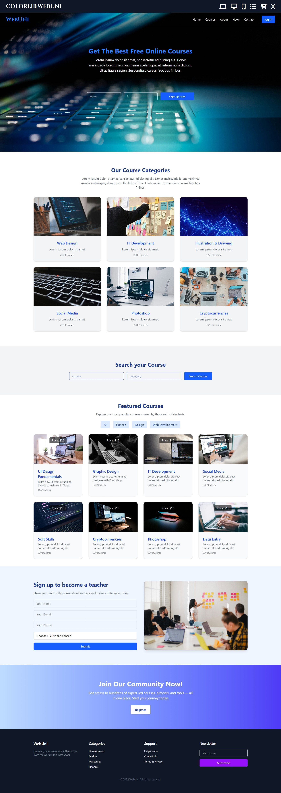

# WebUni – Educational Landing Page

Welcome to **WebUni**, a fully responsive landing page for an educational course platform built entirely with **Tailwind CSS**.

---

##  Features

-  Hero section with background image + overlay
-  Fully responsive layout
-  Sticky or hamburger mobile navbar
-  Search section
-  Course categories and featured courses
-  Sign up form for teachers
-  Call to Action section
-  Clean, accessible footer
-  Smooth hover animations and transitions

---
##  Live Demo:
[Click here to view the site](https://amanyth155.github.io/Courses-Template/)

##  Preview

---

##  Technologies Used

- **Tailwind CSS CDN**
- HTML5 semantic structure
- JavaScript (tiny snippet for mobile menu)
